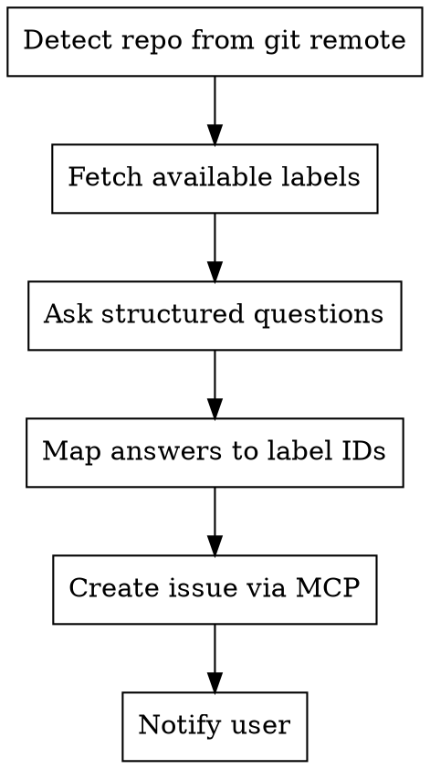

## Pre-requisites

- forgejo-mcp server must be available and successfully connected. Verify by checking that forgejo-mcp tools are listed. If not available: inform the user that the forgejo-mcp MCP server is not connected, and **abort immediately**. Do NOT attempt workarounds such as REST API calls, curl, or any other method — the MCP server is the only supported interface.
- The skill `ntfy-me` is required for notifications whenever any user interaction is required

# Forgejo Issue Creation

Uses the `forgejo-mcp` MCP server to create issues on any Forgejo project.

## Detect Repo

Always derive owner and repo from git remote, never hardcode:

```bash
git remote get-url origin
# https://forgejo.home.janbaer.de/owner/repo.git → owner="owner", repo="repo"
```

## Workflow



### 1. Detect Repo

```bash
git remote get-url origin
```

### 2. Fetch Available Labels

Before asking any questions, fetch all labels from the repo to get their numeric IDs:

```
list_repo_issues(owner, repo, type="issues", state="open")
```

Use the forgejo-mcp label listing capability. Since forgejo-mcp may not have a dedicated label-list tool, fetch labels via the Forgejo API concept — use `search_repos` or inspect issues to discover available label names and their IDs.

> **Important:** Labels are passed to Forgejo as **numeric IDs**, not strings. Always resolve label names to IDs before creating the issue.

If no label-listing tool is available in forgejo-mcp, create the issue without labels and note in the body which labels should be applied manually.

### 3. Ask Structured Questions

Ask the user **all questions at once** in a single message — never spread across multiple round-trips. Do NOT ask for a title — derive it from the Description.

**REQUIRED fields — you MUST ask all 6, in this order:**

| # | Field | Options / Format |
|---|-------|-----------------|
| 1 | **Description** | What is the issue about? (free text — title will be derived from this) |
| 2 | **IssueType** | `Bug` / `Improvement` / `Idea` / `Future` |
| 3 | **Severity** | `Minor` / `Medium` / `High` / `Critical` |
| 4 | **Motivation** | Why does this matter? What problem does it solve? (free text) |
| 5 | **Claude** | `Needs feedback first` (stop and ask before implementing) / `Auto-implement` (Claude can start right away) |
| 6 | **How to test** | How can this be verified once implemented? (free text) |

**The Claude field (#5) is mandatory.** Never skip it. It controls whether future agents can auto-implement or must pause for input.

Example prompt to the user:

> I need a few details to create the issue. Please fill in:
>
> 1. **Description**: What is the issue about?
> 2. **IssueType**: Bug / Improvement / Idea / Future
> 3. **Severity**: Minor / Medium / High / Critical
> 4. **Motivation**: Why does this matter?
> 5. **Claude**: Needs feedback first — or — Auto-implement?
> 6. **How to test**: How can this be verified once done?

Use the `ntfy-me` skill (topic: `claude`) to notify the user that input is needed.

### 4. Map Answers to Label IDs

Match the IssueType and Severity answers to numeric label IDs from step 2.

- If a matching label exists → use its numeric ID
- If no matching label exists → skip it (do not invent label names or IDs)

### 5. Create the Issue

Build the issue body using **exactly** this template — do not add extra sections like "Steps to Reproduce" or "Expected Behavior":

```markdown
## Description

{Description}

## Motivation

{Motivation}

## How to Test

{HowToTest}

## Implementation

Claude: {Needs feedback first | Auto-implement}
```

Then create:

```
create_issue(
  owner, repo,
  title="{concise title derived from Description}",
  body="<body from template above>",
  labels=[<numeric IDs from step 4>]
)
```

### 6. Notify When Done

Use the **ntfy-me** skill to notify with topic `claude`:
- Title: `Issue Created – #{N}: {title}`
- Body: link to the created issue

## MCP Tools Reference

| Tool | Use case |
|------|----------|
| `create_issue` | Create the new issue |
| `list_repo_issues` | Used to inspect labels on existing issues |
| `add_issue_labels` | Apply labels after creation if needed |
