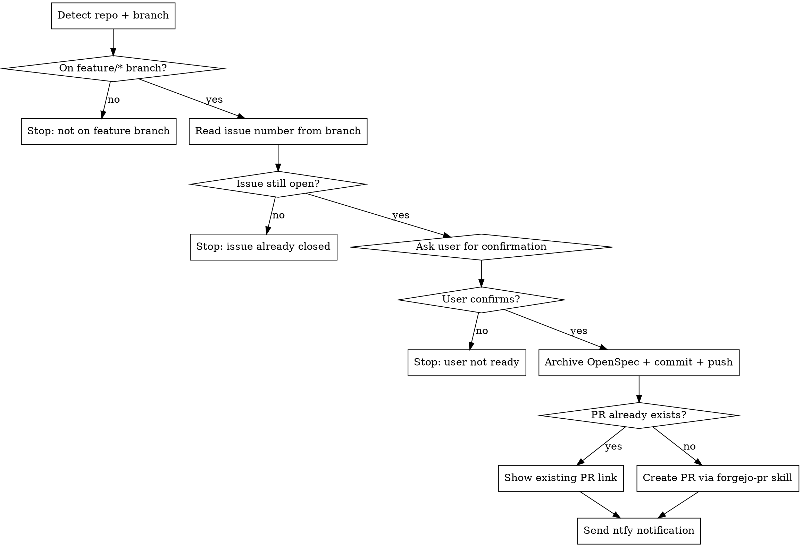

## Pre-requisites

- forgejo-mcp server must be available and successfully connected. Verify by checking that forgejo-mcp tools are listed. If not available: inform the user that the forgejo-mcp MCP server is not connected, and **abort immediately**.

# Forgejo Finish Issue

Archives the OpenSpec change and creates a Pull Request once the user has verified the implementation. This is the second half of the `forgejo-issue` workflow — triggered explicitly by the user after manual testing.

## Workflow



## Steps

### 1. Detect repo and branch

```bash
git remote get-url origin
# https://forgejo.home.janbaer.de/owner/repo.git → owner="owner", repo="repo"

git branch --show-current
# must match feature/* pattern
```

If the current branch does not start with `feature/`, stop and inform the user.

### 2. Read issue number from branch

Branch format: `feature/{N}-{slug}` → issue number is `N`.

```bash
git branch --show-current
# feature/42-fix-login-redirect → N=42
```

### 3. Validate issue is still open

```
get_issue_by_index(owner, repo, index=N)
```

Check `state`. If `state != "open"`, stop and inform the user the issue is already closed.

Read the issue title — you'll need it for the PR and notification.

### 4. Confirm with the user

Ask once:

> "Are you satisfied with the implementation and ready to archive the OpenSpec change and create the PR?"

If the user says no, stop. No further action.

### 5. Archive the OpenSpec change and push

Derive the change name from the branch slug (the part after `{N}-`):

```bash
openspec archive "<change-name>"
git add openspec/
git commit -m "openspec ♻️: Archiving OpenSpec change <change-name>"
git push
```

### 6. Check for existing PR

```
list_repo_pull_requests(owner, repo, state="open")
```

Filter by `head` branch matching the current feature branch.

- **PR found** → show the user the link, skip creation
- **No PR found** → invoke the **forgejo-pr** skill to create the PR; always include `closes #N` in the PR body

### 7. Send notification

```bash
~/bin/ntfy --topic "claude" --title "PR ready" "#N: <issue title>"
```

Send this whether the PR was newly created or already existed.

## MCP Tools Reference

| Tool | Use case |
|------|----------|
| `get_issue_by_index` | Validate issue state and read title |
| `list_repo_pull_requests` | Check for existing open PR on this branch |
