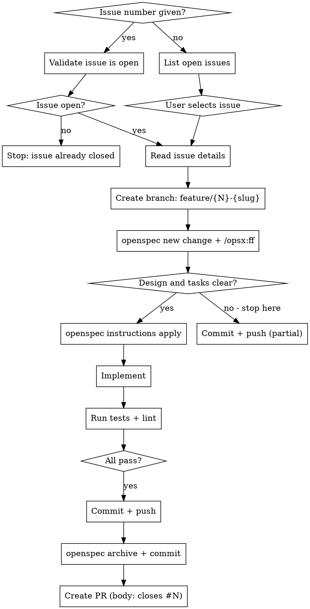

# Forgejo Issue Management

Uses the `forgejo-mcp` MCP server (configured globally in `~/.claude.json`) to interact with issues on any Forgejo project.

## Detect Repo

Always derive owner and repo from git remote, never hardcode:

```bash
git remote get-url origin
# https://forgejo.home.janbaer.de/owner/repo.git → owner="owner", repo="repo"
```

## Full Workflow



## Autonomy principle

**Minimize user interaction.** Only stop to ask if genuinely blocked. Never pause to confirm next steps when the path forward is clear. Keep moving.

The only required user input in the entire workflow is choosing which issue to work on (step 1, when no issue number is given). Everything else runs automatically.

## Steps

### 1. Select issue

**If an issue number was passed as argument:**

```
get_issue_by_index(owner, repo, index=N)
```

Check `state` in the response. If `state != "open"`, stop and inform the user the issue is already closed. If open, skip straight to step 2.

**If no issue number was given:**

```
list_repo_issues(owner, repo, state="open")
```

Show a numbered summary. Ask the user which to work on. **This is the only point where user input is required.**

### 2. Read the issue

```
get_issue_by_index(owner, repo, index=N)
list_issue_comments(owner, repo, index=N)
```

Understand what the issue is about before doing anything else.

### 3. Create feature branch

Ensure the main branch is checked out and up to date before branching:

```bash
git checkout main
git pull
git checkout -b feature/42-fix-login-redirect
```

Branch name: `feature/{issue-number}-{short-slug}`

### 4. Create OpenSpec change and fast-forward

```bash
openspec new change "<change-name>"
```

Then invoke `/opsx:ff` to fast-forward through artifact creation (proposal → specs → design → tasks) in one pass. **Do not wait for user confirmation after `/opsx:ff` completes — proceed immediately to step 5.**

### 5. Evaluate clarity and continue

After `/opsx:ff` completes, assess whether design and tasks are clear enough to implement **without asking the user**:

- **Clear** → immediately run `openspec instructions apply --change "<name>"` and proceed to implementation without pausing
- **Not clear** → commit what exists, push the branch, then explain to the user what is ambiguous and what decision is needed

When in doubt, lean toward continuing. Only stop if implementation truly cannot proceed without a decision that only the user can make.

### 6. Implement

Follow the tasks from `openspec instructions apply`. Work through each task in order without stopping for confirmation between tasks.

### 7. Run tests and lint

Run the project's test and lint commands before committing. Fix failures before proceeding — do not ask the user whether to fix them.

### 8. Commit and push

```bash
git add <files>
git commit -m "<message>"
git push -u origin feature/42-fix-login-redirect
```

### 9. Archive the OpenSpec change and commit

```bash
openspec archive "<change-name>"
git add openspec/
git commit -m "Archive OpenSpec change <change-name>"
git push
```

### 10. Create a Pull Request

Include `closes #N` in the PR body — Forgejo will automatically close the issue when the PR is merged.

```
create_pull_request(
  owner, repo,
  title="...",
  head="feature/42-...",
  base="main",
  body="...\n\ncloses #42"
)
```

Do **not** manually close the issue or call `issue_state_change` — the merge handles it.

## MCP Tools Reference

| Tool | Use case |
|------|----------|
| `list_repo_issues` | Browse open issues |
| `get_issue_by_index` | Read issue details or validate state |
| `list_issue_comments` | Read issue discussion |
| `create_pull_request` | Open a PR with `closes #N` in body |

## If MCP Tools Are Unavailable

> The `forgejo-mcp` MCP server is not active. Restart Claude Code — it is configured in `~/.claude.json` using the wrapper at `~/Projects/dotfiles/bin/forgejo-mcp-wrapper`.
